# Data Flow Architecture

## System Overview


## Data Processing Pipeline


## Component Communication

### Before (Prop Drilling)


### After (Zustand Store)


## Store State Structure

```mermaid
graph TB
    Store[Zustand Store]

    Store --> RawData[rawData: SpotifyHistoryItem<br/>All individual plays]
    Store --> AggData[aggregatedData: SpotifyHistoryItem<br/>Grouped by track URI]
    Store --> Loading[isLoading: boolean]
    Store --> Error[error: string | null]

    Store --> Actions[Actions]
    Actions --> LoadData[loadData]
    Actions --> Reset[reset]
    Actions --> SetRaw[setRawData]
    Actions --> SetAgg[setAggregatedData]

    style Store fill:#4CAF50,stroke:#2E7D32,color:#fff
    style Actions fill:#2196F3,stroke:#1565C0,color:#fff
```

## Data Transformation Flow


## View Component Pattern


## Planned Visualizations Map

```mermaid
mindmap
  root((Spotify<br/>Visualizer))
    Time Analysis
      Line Chart: Daily/Weekly/Monthly
      Heatmap: Hour × Weekday
      Calendar: GitHub-style
    Top Lists
      Bar Chart: Artists
      Bar Chart: Songs
      Treemap: Genre Distribution
      Pareto: 80/20 Analysis
    Behavior
      Scatter: Playtime vs Skips
      Skip Rate by Artist
      Session Length Analysis
    Platform
      Donut: Device Distribution
      Stacked Bar: Platform Over Time
    Mood/Tempo
      Radar: Audio Features
      Timeline: Mood Changes
    Geographic
      Map: Listening Locations
      Heatmap: Travel Patterns
```


